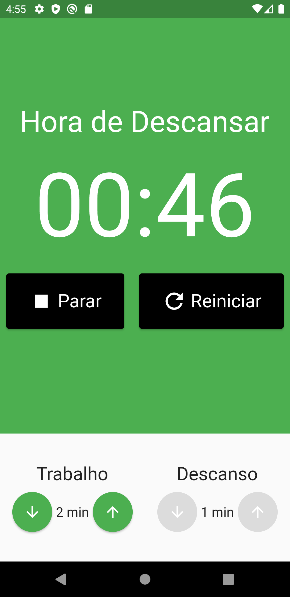

# Pomodoro Flutter

Um sistema para gerenciamento de tempo e produtividade. Essa aplicação faz uso da técnida de Pomodoro para que o usuário consiga gerenciar o seu trabalho ou estudo.

## Tecnologias

As seguintes tecnologias e pacotes foram usadas na construção do projeto:

- [Flutter](https://flutter.dev/)
- [MobX](https://mobx.netlify.app/)
- [mobx](https://pub.dev/packages/mobx)
- [flutter_mobx](https://pub.dev/packages/flutter_mobx)
- [provider](https://pub.dev/packages/provider)
- [build_runner](https://pub.dev/packages/build_runner)
- [mobx_codegen](https://pub.dev/packages/mobx_codegen)

## Como Usar

```
 - Clone esse repositório:
 $ git clone https://github.com/lucas-salles/pomodoro-flutter.git

 - Entre no diretório:
 $ cd pomodoro-flutter

 - Instale as dependências:
 $ flutter pub get

 - Inicie o app: 
 $ flutter run
 ```

<div>
  
  
  
  
</div>